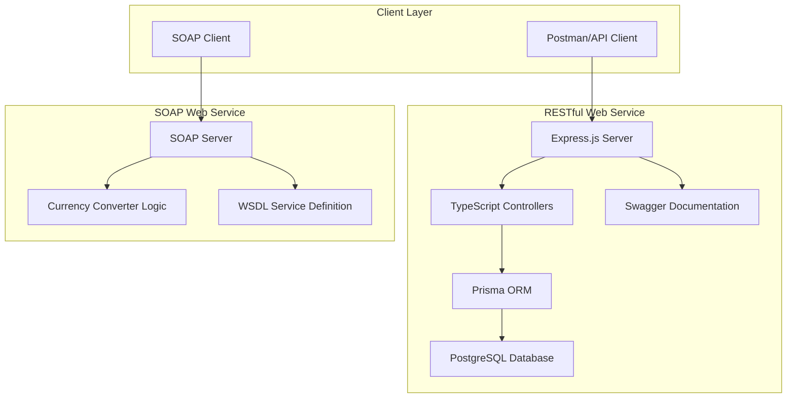

# 🌐 Web Services Assignment

A comprehensive implementation of both **RESTful** and **SOAP** web services demonstrating modern web service development practices.

---

## 📋 Project Overview

This project showcases the implementation of two distinct web service architectures:

1. **RESTful Web Service** - Student Management System API
2. **SOAP Web Service** - Currency Converter Service

Both services demonstrate industry-standard practices including proper error handling, documentation, and testing methodologies.

---

## 🏗️ Architecture



---

## 🚀 Quick Start

### Prerequisites

- Node.js (v16 or higher)
- NeonDB
- npm or yarn package manager

### Installation

**Option 1: Automated Setup (Recommended)**

```bash
# Windows
setup.bat

# Linux/Mac
chmod +x setup.sh
./setup.sh
```

**Option 2: Manual Setup**

```bash
# Clone the repository
git clone https://github.com/kitessafikadu/web-service.git
cd web-service

# Setup RESTful service
cd RESTful-web-service
npm install
cp env.example .env
# Edit .env with your database configuration
npx prisma migrate dev
cd ..

# Setup SOAP service
cd SOAP-web-service
npm install
cd ..
```

### Running the Services

**Start RESTful Service:**

```bash
cd RESTful-web-service
npm run dev
```

**Start SOAP Service:**

```bash
cd SOAP-web-service
npm start
```

---

## 📁 Project Structure

```
web-service/
├── README.md                           # This file
├── setup.bat                          # Windows setup script
├── setup.sh                           # Linux/Mac setup script
├── docs/
│   ├── report.md                      # Comprehensive assignment report
│   ├── postman-collection.json        # Postman collection for testing
│   └── support/                       # Screenshots and documentation
├── RESTful-web-service/               # RESTful API implementation
│   ├── src/
│   │   ├── server.ts                  # Main server file
│   │   ├── controllers/               # API controllers
│   │   ├── routes/                    # API routes
│   │   ├── config/                    # Configuration files
│   │   └── prisma/                    # Database client
│   ├── prisma/
│   │   ├── schema.prisma              # Database schema
│   │   └── migrations/                # Database migrations
│   ├── env.example                    # Environment variables template
│   └── README.md                      # RESTful service documentation
└── SOAP-web-service/                  # SOAP service implementation
    ├── server.js                      # SOAP server implementation
    ├── currency-converter.wsdl        # WSDL service definition
    └── README.md                      # SOAP service documentation
```

---

## 🧪 Testing

### Postman Collection

Import the provided Postman collection for comprehensive testing:

- File: `docs/postman-collection.json`
- Includes both RESTful and SOAP service tests
- Pre-configured requests with sample data

### API Documentation

- **RESTful API**: http://localhost:3002/api-docs (Swagger UI)
- **SOAP WSDL**: http://localhost:8000/wsdl?wsdl

### Health Check

- **RESTful Service**: http://localhost:3002/health
- **SOAP Service**: http://localhost:8000/wsdl

---

## 🛠️ Technologies Used

### RESTful Service

- **TypeScript** - Type-safe JavaScript
- **Express.js** - Web framework
- **Prisma** - Database ORM
- **PostgreSQL** - Relational database
- **Swagger/OpenAPI** - API documentation

### SOAP Service

- **Node.js** - JavaScript runtime
- **Express.js** - Web framework
- **SOAP Library** - SOAP protocol implementation
- **XML2JS** - XML parsing

### Development Tools

- **Postman** - API testing
- **Git** - Version control
- **npm** - Package management

---

## 📊 Features

### RESTful API Features

- ✅ Complete CRUD operations for Students, Teachers, Courses, Enrollments
- ✅ TypeScript implementation with type safety
- ✅ Database relationships and constraints
- ✅ Comprehensive error handling
- ✅ Input validation
- ✅ Swagger API documentation
- ✅ Health check endpoint
- ✅ Environment configuration

### SOAP Service Features

- ✅ Multi-currency conversion (9 currencies)
- ✅ WSDL service definition
- ✅ SOAP fault handling
- ✅ XML-based communication
- ✅ Service discovery
- ✅ Comprehensive error responses

---

## 📚 Documentation

- **[Assignment Report](docs/report.md)** - Comprehensive project report
- **[RESTful Service README](RESTful-web-service/README.md)** - Detailed RESTful API documentation
- **[SOAP Service README](SOAP-web-service/README.md)** - Detailed SOAP service documentation

---

## 👥 Team Members

| Name             | ID        | Department           |
| ---------------- | --------- | -------------------- |
| Bethelhem Tadege | RU0457/14 | Software Engineering |
| Kitessa Fikadu   | RU1640/14 | Software Engineering |
| Nabon Girma      | RU0127/14 | Software Engineering |
| Naol Legesse     | RU4750/14 | Software Engineering |
| Sikar Yosef      | RU0161/14 | Software Engineering |

---

## 🔧 Development

### Adding New Features

1. Create feature branch from main
2. Implement changes with proper TypeScript types
3. Add tests and documentation
4. Submit pull request

### Database Changes

1. Update `prisma/schema.prisma`
2. Generate migration: `npx prisma migrate dev`
3. Update API documentation if needed

---

## 📄 License

This project is created for educational purposes as part of a web services assignment.

---
