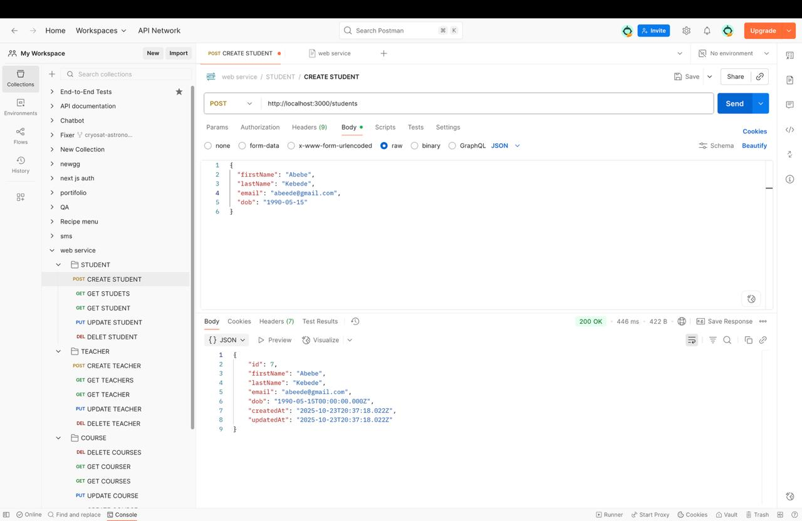
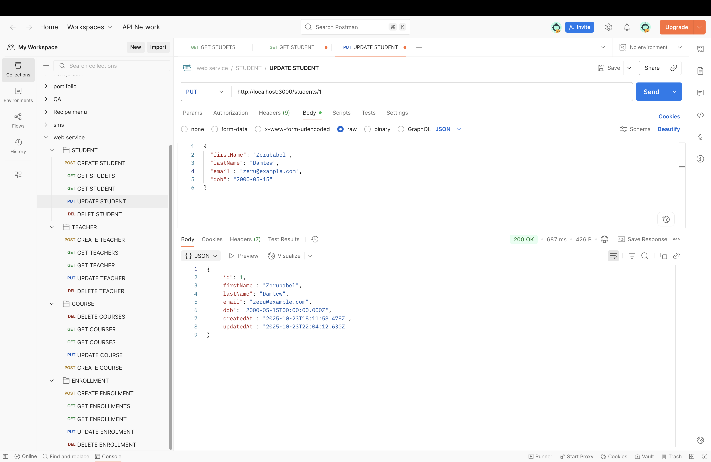
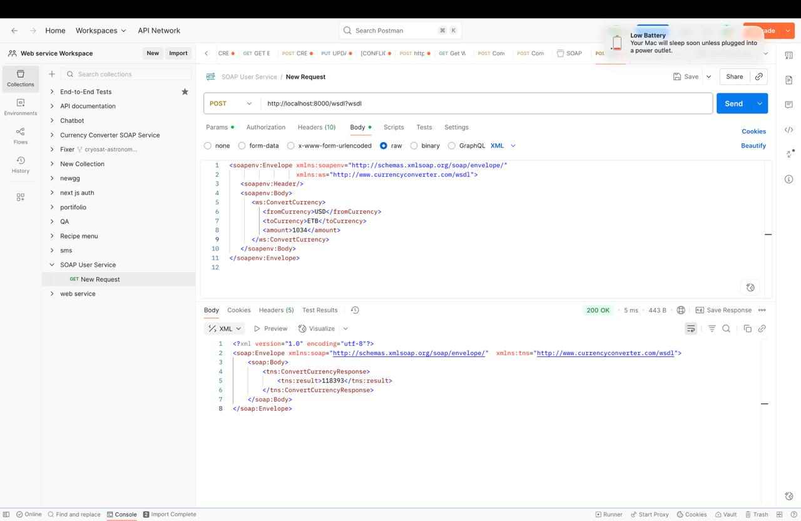

# 🧾 Web Services Implementation - Assignment 1 Report

## 👥 Team Members & Task Distribution

| No. | Student Name         | ID No     | Department           |
| --- | -------------------- | --------- | -------------------- |
| 1   | **Bethelhem Tadege** | RU0457/14 | Software Engineering |
| 2   | **Kitessa Fikadu**   | RU1640/14 | Software Engineering |
| 3   | **Nabon Girma**      | RU0127/14 | Software Engineering |
| 4   | **Naol Legesse**     | RU4750/14 | Software Engineering |
| 5   | **Sikar Yosef**      | RU0161/14 | Software Engineering |

---

## 🎯 Project Overview

This project demonstrates the implementation and testing of **Web Services** using both **RESTful** and **SOAP** architectures.  
The assignment consists of two main parts:

1. Developing a **Student Management RESTful API**.
2. Building and consuming a **Currency Converter SOAP Service**.

---

## 📋 Table of Contents

1. [Introduction](#1-introduction)
2. [Implementation Steps](#2-implementation-steps)
3. [Tools and Technologies Used](#3-tools-and-technologies-used)
4. [Results and Observations](#4-results-and-observations)

---

## 1. Introduction

### 🔹 Exercise 1: RESTful Web Service – Student Management System

**Objective:**  
Develop a REST API that performs CRUD operations (Create, Read, Update, Delete) on student records using JSON-based communication.

**Key Features:**

- Full CRUD functionality for managing students.
- JSON-based request and response handling.
- Proper HTTP status codes (`200`, `201`, `404`, `500`).

---

### 🔹 Exercise 2: SOAP-based Web Service – Currency Converter

**Objective:**  
Design and implement a SOAP web service that converts amounts between different currencies (e.g., USD, EUR, GBP, ETB) using XML-based message exchange.

**Key Features:**

- Conversion logic between multiple currencies.
- WSDL file generation for service description.
- SOAP fault handling for invalid or unsupported currencies.
- SOAP client request and response demonstration.

---

## 2. Implementation Steps

### 🧩 RESTful Web Service – Student Management API

**Step 1: Project Setup**

```bash
mkdir web-service/RESTful-web-service
cd RESTful-web-service
npm init -y
npm install express body-parser nodemon
```

**Step 2: Define the Server**
Created `server.js` and configured Express server with JSON middleware.

**Step 3: Implement CRUD Endpoints**

- **POST /students** → Add a new student
- **GET /students** → Retrieve all students
- **GET /students/:id** → Retrieve a student by ID
- **PUT /students/:id** → Update student information
- **DELETE /students/:id** → Delete a student record

**Step 4: Start the Server**

```bash
npm run dev
```

**Step 5: Test with Postman**

- Created a Postman collection for all endpoints.
- Tested success and error cases with appropriate responses.

---

### 💱 SOAP Web Service – Currency Converter

**Step 1: Define Service Schema**
Defined `currency-converter.wsdl` specifying operations like `ConvertCurrency`.

**Step 2: Implement SOAP Service Logic**

```javascript
function convertCurrency(args) {
  const rates = { USD: 1, EUR: 0.9, GBP: 0.78, ETB: 57 };
  const fromRate = rates[args.from];
  const toRate = rates[args.to];

  if (!fromRate || !toRate) {
    throw {
      Fault: { faultcode: "Client", faultstring: "Unsupported currency code" },
    };
  }

  const result = (args.amount * toRate) / fromRate;
  return { result: result.toFixed(2) };
}
```

**Step 3: Run SOAP Server**

```bash
node soapServer.js
```

**Step 4: Generate and Validate WSDL**

- The WSDL file was automatically generated for clients.
- Verified WSDL structure using `?wsdl` endpoint.

**Step 5: Test with SOAP Client (Postman or SOAP UI)**

- Constructed XML requests for currency conversion.
- Verified XML-based SOAP responses and fault handling.

---

## 3. Tools and Technologies Used

| Category                 | Tools / Technologies     | Purpose                      |
| ------------------------ | ------------------------ | ---------------------------- |
| **Programming Language** | JavaScript (Node.js)     | Backend implementation       |
| **Framework**            | Express.js               | REST API development         |
| **SOAP Library**         | `soap` (Node.js package) | SOAP service creation        |
| **Testing Tool**         | Postman / SOAP UI        | API and SOAP request testing |
| **Runtime Environment**  | Node.js                  | Code execution environment   |
| **Data Formats**         | JSON (REST), XML (SOAP)  | Data exchange formats        |
| **Version Control**      | Git & GitHub             | Source code management       |

---

## 4. Results and Observations

### 🧾 RESTful Student Management API

**Sample Request - Add Student**

```http
POST /students
Content-Type: application/json

{
  "firstName": "Daniel",
  "lastName": "Beyen",
  "email": "dani@example.com",
  "dob": "2000-05-15"
}
```

**Sample Response**

```json
{
  "id": 5,
  "firstName": "Abebe",
  "lastName": "Kebede",
  "email": "abe@gmail.com",
  "dob": "1990-05-15T00:00:00.000Z",
  "createdAt": "2025-10-23T18:50:07.467Z",
  "updatedAt": "2025-10-23T18:50:07.467Z"
}
```

**Sample Error Response**

```json
{
  "error": " Email already exists"
}
```

**Screenshot of the request**


**Sample Request - Update Student**

```http
PUT /students/:id
Content-Type: application/json

{
  "firstName": "Daniel",
  "lastName": "Beyen",
  "email": "dani@example.com",
  "dob": "2000-05-15"
}
```

**Sample Response**

```json
{
  "message": "✅ Student created successfully",
  "data": {
    "id": 11,
    "firstName": "Chaltu",
    "lastName": "Fikadu",
    "email": "chali@gmail.com",
    "dob": "1990-05-15T00:00:00.000Z",
    "createdAt": "2025-10-24T07:35:49.962Z",
    "updatedAt": "2025-10-24T07:35:49.962Z"
  }
}
```

**Sample Error Response:**

```json
{
  "error": "Student not found"
}
```

**Screenshot of the request**


---

### 💱 SOAP Currency Converter Service

**Sample Request (XML):**

```xml
<soap:Envelope xmlns:soap="http://schemas.xmlsoap.org/soap/envelope/">
  <soap:Body>
    <ConvertCurrency xmlns="http://example.com/currency">
      <amount>100</amount>
      <from>USD</from>
      <to>ETB</to>
    </ConvertCurrency>
  </soap:Body>
</soap:Envelope>
```

**Sample Response (XML):**

```xml
<soap:Envelope xmlns:soap="http://schemas.xmlsoap.org/soap/envelope/">
  <soap:Body>
    <ConvertCurrencyResponse xmlns="http://example.com/currency">
      <result>5700.00</result>
    </ConvertCurrencyResponse>
  </soap:Body>
</soap:Envelope>
```

**Sample Fault Response:**

```xml
<soap:Envelope xmlns:soap="http://schemas.xmlsoap.org/soap/envelope/">
  <soap:Body>
    <soap:Fault>
      <faultcode>Client</faultcode>
      <faultstring>Unsupported currency code</faultstring>
    </soap:Fault>
  </soap:Body>
</soap:Envelope>
```

**Screenshot Example:**



---

### 🧠 Observations

- REST APIs are simpler to test due to JSON’s readability.
- SOAP required more structure and XML validation but ensures strict data contracts.
- WSDL made client generation straightforward.
- Both services handled error responses gracefully.

---

## ✅ Conclusion

This assignment provided hands-on experience in designing and implementing **RESTful** and **SOAP** web services.
It enhanced our understanding of:

- The differences between JSON (REST) and XML (SOAP) message structures.
- How to build, deploy, and test APIs effectively.
- How service contracts and protocols ensure reliable communication in distributed systems.
