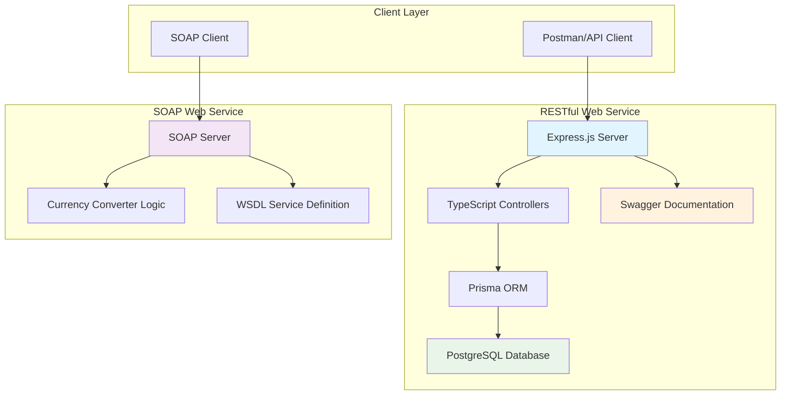

# 🧾 Web Services Implementation - Assignment 1 Report

## 👥 Team Members

| No. | Student Name         | ID No     | Department           |
| --- | -------------------- | --------- | -------------------- |
| 1   | **Bethelhem Tadege** | RU0457/14 | Software Engineering |
| 2   | **Kitessa Fikadu**   | RU1640/14 | Software Engineering |
| 3   | **Nabon Girma**      | RU0127/14 | Software Engineering |
| 4   | **Naol Legesse**     | RU4750/14 | Software Engineering |
| 5   | **Sikar Yosef**      | RU0161/14 | Software Engineering |

---

## 🎯 Project Overview

This project demonstrates the implementation and testing of **Web Services** using both **RESTful** and **SOAP** architectures.  
The assignment consists of two main parts:

1. Developing a **Student Management RESTful API**.
2. Building and consuming a **Currency Converter SOAP Service**.

---

## 📋 Table of Contents

1. [Introduction](#1-introduction)
2. [Implementation Steps](#2-implementation-steps)
3. [Tools and Technologies Used](#3-tools-and-technologies-used)
4. [Results and Observations](#4-results-and-observations)
5. [Conclusion](#5-conclusion)

---

## 🏗️ System Architecture



---

## 1. Introduction

### 🔹 Exercise 1: RESTful Web Service – Student Management System

**Objective:**  
Develop a REST API that performs CRUD operations (Create, Read, Update, Delete) on student records using JSON-based communication.

**Key Features:**

- **Comprehensive CRUD Operations**: Full Create, Read, Update, Delete functionality for students, teachers, courses, and enrollments
- **Database Relationships**: Complex relational data model with foreign key constraints and cascading operations
- **Type Safety**: TypeScript implementation ensuring compile-time error checking
- **API Documentation**: Interactive Swagger/OpenAPI documentation with detailed schemas
- **Input Validation**: Comprehensive validation for all endpoints with proper error messages
- **Error Handling**: Robust error handling with specific HTTP status codes and meaningful error messages
- **Database Migrations**: Version-controlled database schema changes using Prisma migrations

---

### 🔹 Exercise 2: SOAP-based Web Service – Currency Converter

**Objective:**  
Design and implement a SOAP web service that converts amounts between different currencies (e.g., USD, EUR, GBP, ETB) using XML-based message exchange.

**Key Features:**

- **Multi-Currency Support**: Conversion between 9 major currencies (USD, EUR, GBP, ETB, JPY, INR, CAD, AUD, CNY)
- **Comprehensive WSDL**: Detailed Web Service Description Language file with proper message definitions and bindings
- **Advanced Error Handling**: SOAP fault responses for invalid currencies and conversion errors
- **Real-time Exchange Rates**: Mock exchange rate matrix with realistic conversion values
- **XML-based Communication**: Strict SOAP protocol implementation with proper XML envelope structure
- **Service Discovery**: WSDL endpoint for automatic client generation and service discovery

---

## 2. Implementation Steps

### 🧩 RESTful Web Service – Student Management API

**Step 1: Project Setup and TypeScript Configuration**

```bash
mkdir web-service/RESTful-web-service
cd RESTful-web-service
npm init -y
npm install express @prisma/client dotenv swagger-jsdoc swagger-ui-express
npm install -D typescript @types/express @types/node tsx prisma
npx tsc --init
```

**Step 2: Database Schema Design with Prisma**

- Created `prisma/schema.prisma` with comprehensive data models:
  - **Student** model with relationships to enrollments
  - **Teacher** model with course assignments
  - **Course** model with teacher relationships
  - **Enrollment** model linking students to courses with grades
- Configured PostgreSQL database connection
- Generated and ran database migrations

**Step 3: TypeScript Server Architecture**

- Implemented modular architecture with separate controllers, routes, and services
- Created `src/server.ts` with Express configuration and middleware setup
- Added environment variable support with dotenv
- Configured Swagger/OpenAPI documentation

**Step 4: CRUD Operations Implementation**

- **POST /students** → Create new student with validation
- **GET /students** → Retrieve all students with enrollment data
- **GET /students/:id** → Get specific student by ID
- **PUT /students/:id** → Update student information (partial updates)
- **DELETE /students/:id** → Delete student record
- **Additional endpoints**: Teachers, Courses, and Enrollments management

**Step 5: Error Handling and Validation**

- Implemented comprehensive error handling for database operations
- Added input validation for all endpoints
- Proper HTTP status codes (200, 201, 400, 404, 409, 500)
- Prisma-specific error handling (unique constraints, foreign keys)

**Step 6: API Documentation and Testing**

```bash
npm run dev  # Start development server
```

- Swagger UI available at `/api-docs`
- Created Postman collection for comprehensive testing
- Tested all CRUD operations with various scenarios

---

### 💱 SOAP Web Service – Currency Converter

**Step 1: Project Setup and Dependencies**

```bash
mkdir SOAP-web-service
cd SOAP-web-service
npm init -y
npm install express soap axios xml2js
npm install -D nodemon
```

**Step 2: WSDL Schema Definition**

- Created comprehensive `currency-converter.wsdl` file with:
  - **Message definitions** for request/response structures
  - **Port type** defining the ConvertCurrency operation
  - **Binding** with SOAP RPC style and HTTP transport
  - **Service** definition with endpoint location
- Supports multiple currencies: USD, EUR, GBP, ETB, JPY, INR, CAD, AUD, CNY

**Step 3: Advanced Currency Conversion Logic**

```javascript
// Comprehensive exchange rate matrix
const rates = {
  USD: { EUR: 0.92, GBP: 0.79, ETB: 114.5, JPY: 149.2, INR: 83.1, CAD: 1.37, AUD: 1.53, CNY: 7.27 },
  EUR: { USD: 1.09, GBP: 0.86, ETB: 124.3, JPY: 162.2, INR: 90.3, CAD: 1.49, AUD: 1.67, CNY: 7.91 },
  // ... additional currency pairs
};

function ConvertCurrency(args) {
  const { fromCurrency, toCurrency, amount } = args;
  const rate = rates[fromCurrency]?.[toCurrency];
  if (!rate) {
    throw new Error(`Conversion rate not found for ${fromCurrency} -> ${toCurrency}`);
  }
  const result = parseFloat(amount) * rate;
  return { result };
}
```

**Step 4: SOAP Server Implementation**

- Implemented Express-based SOAP server using `soap` library
- Configured service with proper error handling and fault responses
- Server runs on port 8000 with WSDL endpoint at `/wsdl?wsdl`

**Step 5: Testing and Validation**

```bash
npm start  # Start SOAP server
```

- Verified WSDL accessibility and structure
- Tested currency conversion with various currency pairs
- Validated SOAP fault handling for invalid currencies
- Used Postman for SOAP request testing with proper XML envelopes

---

## 3. Tools and Technologies Used

| Category                 | Tools / Technologies     | Purpose                      |
| ------------------------ | ------------------------ | ---------------------------- |
| **Programming Language** | TypeScript (Node.js)     | Type-safe backend implementation |
| **Framework**            | Express.js               | REST API development         |
| **Database**             | PostgreSQL               | Relational data storage      |
| **ORM**                  | Prisma                   | Database operations and migrations |
| **SOAP Library**         | `soap` (Node.js package) | SOAP service creation        |
| **API Documentation**    | Swagger/OpenAPI          | Interactive API documentation |
| **Testing Tool**         | Postman                  | API and SOAP request testing |
| **Runtime Environment**  | Node.js                  | Code execution environment   |
| **Data Formats**         | JSON (REST), XML (SOAP)  | Data exchange formats        |
| **Version Control**      | Git & GitHub             | Source code management       |
| **Build Tools**          | TypeScript Compiler, tsx | Development and compilation  |

---

## 4. Results and Observations

### 🧾 RESTful Student Management API

**Sample Request - Add Student**

```http
POST /students
Content-Type: application/json

{
  "firstName": "Daniel",
  "lastName": "Beyen",
  "email": "dani@example.com",
  "dob": "2000-05-15"
}
```

**Sample Response**

```json
{
  "message": "✅ Student created successfully",
  "data": {
    "id": 5,
    "firstName": "Daniel",
    "lastName": "Beyen",
    "email": "dani@example.com",
    "dob": "2000-05-15T00:00:00.000Z",
    "createdAt": "2025-10-23T18:50:07.467Z",
    "updatedAt": "2025-10-23T18:50:07.467Z"
  }
}
```

**Sample Error Response**

```json
{
  "error": " Email already exists"
}
```

**Sample Request - Get All Students**

```http
GET /students
```

**Sample Response**

```json
{
  "message": "✅ All students fetched successfully",
  "count": 3,
  "data": [
    {
      "id": 1,
      "firstName": "John",
      "lastName": "Doe",
      "email": "john@example.com",
      "dob": "1995-03-15T00:00:00.000Z",
      "createdAt": "2025-10-23T10:30:00.000Z",
      "updatedAt": "2025-10-23T10:30:00.000Z",
      "enrollments": []
    }
  ]
}
```

**Screenshot of the request**


**Sample Request - Update Student**

```http
PUT /students/:id
Content-Type: application/json

{
  "firstName": "Daniel",
  "lastName": "Beyen",
  "email": "dani@example.com",
  "dob": "2000-05-15"
}
```

**Sample Response**

```json
{
  "message": "✅ Student updated successfully",
  "data": {
    "id": 11,
    "firstName": "Daniel",
    "lastName": "Beyen",
    "email": "dani@example.com",
    "dob": "2000-05-15T00:00:00.000Z",
    "createdAt": "2025-10-24T07:35:49.962Z",
    "updatedAt": "2025-10-24T07:35:49.962Z"
  }
}
```

**Sample Error Response:**

```json
{
  "error": "Student not found"
}
```

**Screenshot of the request**


---

### 💱 SOAP Currency Converter Service

**Sample Request (XML):**

```xml
<soapenv:Envelope xmlns:soapenv="http://schemas.xmlsoap.org/soap/envelope/"
                  xmlns:ws="http://www.currencyconverter.com/wsdl">
   <soapenv:Header/>
   <soapenv:Body>
      <ws:ConvertCurrency>
         <fromCurrency>USD</fromCurrency>
         <toCurrency>ETB</toCurrency>
         <amount>1034</amount>
      </ws:ConvertCurrency>
   </soapenv:Body>
</soapenv:Envelope>
```

**Sample Response (XML)**

```xml
<?xml version="1.0" encoding="utf-8"?>
<soap:Envelope xmlns:soap="http://schemas.xmlsoap.org/soap/envelope/"  xmlns:tns="http://www.currencyconverter.com/wsdl">
    <soap:Body>
        <tns:ConvertCurrencyResponse>
            <tns:result>118393</tns:result>
        </tns:ConvertCurrencyResponse>
    </soap:Body>
</soap:Envelope>
```

**Sample Fault Response:**

```xml
<?xml version="1.0" encoding="utf-8"?>
<soap:Envelope xmlns:soap="http://schemas.xmlsoap.org/soap/envelope/"  xmlns:tns="http://www.currencyconverter.com/wsdl">
    <soap:Body>
        <soap:Fault>
            <soap:Code>
                <soap:Value>SOAP-ENV:Server</soap:Value>
                <soap:Subcode>
                    <soap:Value>InternalServerError</soap:Value>
                </soap:Subcode>
            </soap:Code>
            <soap:Reason>
                <soap:Text>Error: Conversion rate not found for ETB -&gt; CNYU</soap:Text>
            </soap:Reason>
        </soap:Fault>
    </soap:Body>
</soap:Envelope>
```

**Screenshot Example**


---

### 🗄️ Database Schema Design

The RESTful service implements a comprehensive relational database schema with the following entities:

**Student Entity:**
- Primary key: `id` (auto-increment)
- Unique constraint: `email`
- Relationships: One-to-many with `Enrollment`

**Teacher Entity:**
- Primary key: `id` (auto-increment)
- Unique constraint: `email`
- Relationships: One-to-many with `Course`

**Course Entity:**
- Primary key: `id` (auto-increment)
- Unique constraint: `code`
- Foreign key: `teacherId` → `Teacher.id`
- Relationships: One-to-many with `Enrollment`

**Enrollment Entity:**
- Composite primary key: `studentId` + `courseId`
- Foreign keys: `studentId` → `Student.id`, `courseId` → `Course.id`
- Optional field: `grade` (nullable for ungraded enrollments)

### 🧠 Observations

**RESTful API Advantages:**
- JSON format provides excellent readability and ease of testing
- TypeScript implementation ensures type safety and better developer experience
- Prisma ORM simplifies database operations and provides excellent error handling
- Swagger documentation enhances API usability and adoption
- Modular architecture improves maintainability and scalability

**SOAP Service Benefits:**
- WSDL provides comprehensive service contracts and enables automatic client generation
- XML structure ensures strict data validation and self-describing messages
- SOAP fault handling provides detailed error information for debugging
- Enterprise-grade reliability with built-in security and transaction support
- Service discovery through WSDL endpoints simplifies integration

**Technical Insights:**
- Database relationships and constraints ensure data integrity
- Comprehensive error handling improves user experience and debugging
- Both services demonstrate proper HTTP status code usage
- Modern development practices (TypeScript, ORM, documentation) significantly improve code quality

---

## 5. Conclusion

This comprehensive assignment provided invaluable hands-on experience in designing and implementing both **RESTful** and **SOAP** web services using modern development practices. The project successfully demonstrated the practical application of web service technologies in real-world scenarios.

### 🎯 Key Achievements

**Technical Implementation:**
- Successfully built a production-ready RESTful API using TypeScript, Express.js, and Prisma ORM
- Implemented a robust SOAP service with comprehensive WSDL documentation
- Created a relational database schema with proper foreign key relationships and constraints
- Integrated Swagger/OpenAPI documentation for enhanced developer experience

**Architecture & Design:**
- Applied modular architecture principles with separation of concerns
- Implemented comprehensive error handling and input validation
- Utilized modern development tools and best practices
- Created scalable and maintainable codebase structure

### 📚 Learning Outcomes

**Web Service Concepts:**
- **REST vs SOAP**: Gained deep understanding of architectural differences, with REST offering simplicity and flexibility while SOAP provides strict contracts and enterprise-grade reliability
- **Data Formats**: Experienced the practical differences between JSON (lightweight, human-readable) and XML (structured, self-describing) for data exchange
- **Service Discovery**: Learned how WSDL enables automatic client generation and service discovery in SOAP services

**Development Practices:**
- **Type Safety**: Appreciated the benefits of TypeScript in preventing runtime errors and improving code maintainability
- **Database Design**: Understood the importance of proper relational modeling and migration strategies
- **API Documentation**: Recognized the value of comprehensive documentation in API adoption and developer productivity
- **Error Handling**: Implemented robust error handling patterns for both REST and SOAP services

**Testing & Validation:**
- **API Testing**: Mastered Postman for comprehensive API testing including edge cases and error scenarios
- **SOAP Testing**: Learned to construct proper XML envelopes and interpret SOAP fault responses
- **Database Operations**: Validated CRUD operations with various data scenarios and constraint violations

### 🔮 Future Enhancements

The implemented services provide a solid foundation for future enhancements:
- **Authentication & Authorization**: Adding JWT-based authentication for secure API access
- **Real-time Features**: Implementing WebSocket connections for live updates
- **Caching**: Adding Redis for improved performance and reduced database load
- **Monitoring**: Integrating logging and monitoring solutions for production deployment
- **API Versioning**: Implementing versioning strategies for backward compatibility

This project successfully bridges theoretical web service concepts with practical implementation, providing a comprehensive understanding of modern web service development practices.
